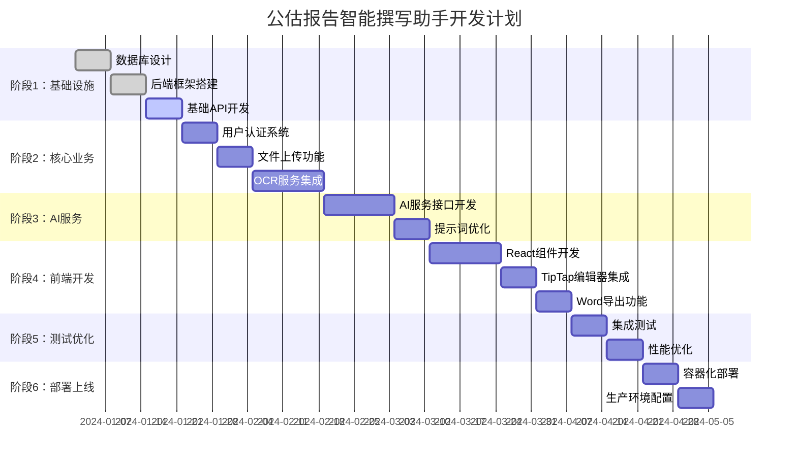

我将帮您检查所有设计文档并提供开发步骤和计划建议。首先让我探索您的工作空间结构。
Ran tool
太好了！我发现了一系列设计文档。让我读取所有这些设计文档来了解项目的完整情况。
Read file: 01_prd_mvp.md
Read file: 02_agent_mvp_prompt.md
Read file: 03_architecture.md
Read file: 04_database_schema.md
Read file: 05_api_design.md
Read file: 06_deployment_devops.md
现在我已经完整阅读了所有的设计文档。基于这些文档的分析，我将为您提供详细的开发步骤和计划建议。
Ran tool
Ran tool
Ran tool
Ran tool
基于对所有设计文档的详细分析，我为您提供以下开发步骤和计划建议：

## 📋 项目概览

**公估报告智能撰写助手** 是一个AI驱动的保险理赔报告生成系统，采用MVP开发模式，核心目标是通过AI技术帮助公估师快速生成高质量的报告初稿。

## 🎯 开发计划总览

**预估总工期：13-18周（约3-4个月）**

## 🚀 详细开发步骤

### 阶段1：基础设施搭建（2-3周）

#### 1.1 数据库设计与实现
**时间：1周**
- [ ] 创建PostgreSQL数据库
- [ ] 实现用户表（users）
- [ ] 实现文件上传表（uploaded_files）
- [ ] 实现报告草稿表（report_drafts）
- [ ] 设置数据库索引和约束
- [ ] 编写数据库迁移脚本

#### 1.2 后端框架搭建
**时间：1-2周**
- [ ] 初始化FastAPI项目结构
- [ ] 配置项目依赖（requirements.txt）
- [ ] 设置环境配置管理
- [ ] 实现数据库连接池
- [ ] 配置日志系统
- [ ] 设置CORS和安全中间件

**交付物：**
- 可运行的FastAPI应用
- 数据库表结构完整
- 基础配置文件

### 阶段2：核心业务功能开发（3-4周）

#### 2.1 用户认证系统
**时间：1周**
- [ ] 实现用户注册API（`POST /auth/register`）
- [ ] 实现用户登录API（`POST /auth/login`）
- [ ] 实现JWT令牌生成和验证
- [ ] 实现用户信息获取API（`GET /auth/me`）
- [ ] 添加密码哈希和验证

#### 2.2 文件管理系统
**时间：1周**
- [ ] 配置对象存储（MinIO或云存储）
- [ ] 实现文件上传API（`POST /files/upload`）
- [ ] 实现文件信息查询API（`GET /files/{file_id}`）
- [ ] 添加文件类型验证和大小限制
- [ ] 实现文件访问权限控制

#### 2.3 OCR服务集成
**时间：2周**
- [ ] 评估和选择OCR方案（MarkItDown vs 云服务）
- [ ] 实现OCR服务封装
- [ ] 集成异步任务处理（Celery + Redis）
- [ ] 实现OCR结果存储和查询
- [ ] 添加OCR状态跟踪和错误处理

**交付物：**
- 完整的文件上传和OCR处理流程
- 用户认证和权限控制
- API文档（自动生成）

### 阶段3：AI服务集成（2-3周）

#### 3.1 AI服务接口开发
**时间：2周**
- [ ] 设计AI服务接口架构
- [ ] 实现LLM API调用封装
- [ ] 实现提示词模板管理
- [ ] 开发章节生成API（`POST /reports/{report_id}/generate-chapter`）
- [ ] 添加AI服务错误处理和重试机制

#### 3.2 提示词优化和测试
**时间：1周**
- [ ] 实现6个核心章节的提示词模板
- [ ] 进行提示词效果测试和优化
- [ ] 实现上下文数据提取和处理
- [ ] 添加生成内容的后处理逻辑

**交付物：**
- 可用的AI章节生成功能
- 优化的提示词模板
- AI服务性能基准测试报告

### 阶段4：前端界面开发（3-4周）

#### 4.1 React项目初始化
**时间：1周**
- [ ] 创建Next.js项目
- [ ] 配置TypeScript和ESLint
- [ ] 设置UI组件库（如Ant Design或Material-UI）
- [ ] 实现路由配置
- [ ] 设置API客户端（axios）

#### 4.2 核心页面开发
**时间：2周**
- [ ] 实现用户登录/注册页面
- [ ] 实现文件上传界面（聊天式）
- [ ] 实现报告列表页面
- [ ] 实现报告详情页面
- [ ] 添加响应式设计

#### 4.3 富文本编辑器集成
**时间：1周**
- [ ] 集成TipTap编辑器
- [ ] 实现半屏滑出编辑面板
- [ ] 添加基础富文本功能（标题、段落、列表等）
- [ ] 实现内容自动保存
- [ ] 添加AI生成内容的插入功能

**交付物：**
- 完整的前端用户界面
- 集成的富文本编辑器
- 响应式设计

### 阶段5：集成测试与优化（2周）

#### 5.1 功能集成测试
**时间：1周**
- [ ] 端到端用户流程测试
- [ ] API接口集成测试
- [ ] 文件上传和OCR流程测试
- [ ] AI章节生成功能测试
- [ ] Word导出功能测试

#### 5.2 性能优化
**时间：1周**
- [ ] 数据库查询优化
- [ ] API响应时间优化
- [ ] 前端加载性能优化
- [ ] OCR和AI服务并发处理优化
- [ ] 缓存策略实现

**交付物：**
- 完整的测试报告
- 性能优化报告
- 用户使用手册

### 阶段6：部署与上线（1-2周）

#### 6.1 容器化部署
**时间：1周**
- [ ] 编写Dockerfile（前端、后端、数据库）
- [ ] 配置Docker Compose
- [ ] 设置环境变量管理
- [ ] 配置Nginx反向代理
- [ ] 实现健康检查

#### 6.2 生产环境配置
**时间：1周**
- [ ] 云服务器配置
- [ ] SSL证书配置
- [ ] 数据库备份策略
- [ ] 监控和日志配置
- [ ] CI/CD流程设置

**交付物：**
- 生产环境部署
- 运维文档
- 监控仪表板

## ⚠️ 关键风险和建议

### 技术风险
1. **OCR准确率**：建议先用云服务验证，后期可考虑自建
2. **AI服务成本**：需要监控API调用成本，实现缓存机制
3. **Word导出兼容性**：建议使用python-docx库，测试多种Word版本

### 开发建议
1. **MVP优先**：先实现核心功能，后续迭代优化
2. **模块化开发**：各组件独立开发，便于并行工作
3. **持续测试**：每个阶段都要进行充分测试
4. **文档同步**：及时更新API文档和用户手册

## 📊 资源配置建议

### 团队配置
- **后端开发**：2人（FastAPI、数据库、AI服务）
- **前端开发**：2人（React、UI/UX）
- **DevOps**：1人（部署、运维）
- **产品/测试**：1人（需求、测试）

### 技术栈确认
- **前端**：React + Next.js + TypeScript + TipTap
- **后端**：Python + FastAPI + PostgreSQL + Redis
- **AI服务**：OpenAI API 或其他LLM服务
- **部署**：Docker + Nginx + 云服务器

这个开发计划基于您的设计文档制定，考虑了MVP的特点和技术复杂度。建议按阶段执行，每个阶段结束后进行评审和调整。