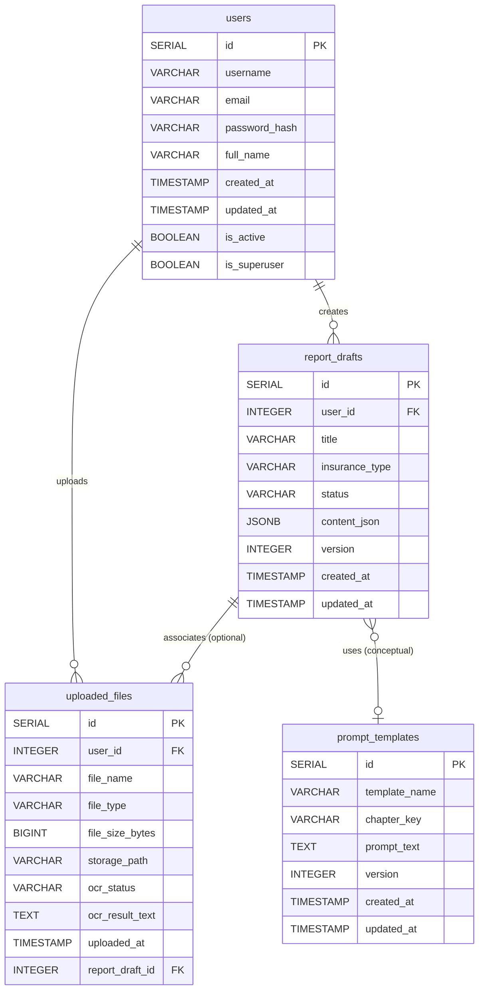

# 数据库表结构设计 (MVP)

本文档详细描述了“公估报告智能撰写助手”MVP版本所需的数据库表结构，基于PostgreSQL设计。

## 1. 设计原则

*   **规范性**: 遵循第三范式 (3NF) 以减少数据冗余，但在必要时为性能考虑可适当反规范化。
*   **可扩展性**: 设计时考虑未来功能的扩展，如更复杂的报告版本管理、团队协作等。
*   **清晰性**: 字段命名清晰、一致，易于理解。

## 2. 数据表定义

### 2.1 `users` - 用户表

存储用户信息。

| 字段名        | 数据类型          | 约束/索引        | 描述                       |
|---------------|-------------------|-----------------|----------------------------|
| `id`          | `SERIAL`          | `PRIMARY KEY`   | 用户唯一标识符 (自增)        |
| `username`    | `VARCHAR(255)`    | `UNIQUE`, `NOT NULL` | 用户名 (用于登录)            |
| `email`       | `VARCHAR(255)`    | `UNIQUE`, `NOT NULL` | 用户邮箱                   |
| `password_hash` | `VARCHAR(255)`    | `NOT NULL`      | 哈希后的用户密码             |
| `full_name`   | `VARCHAR(255)`    |                 | 用户全名                   |
| `created_at`  | `TIMESTAMP WITH TIME ZONE` | `DEFAULT NOW()` | 用户创建时间               |
| `updated_at`  | `TIMESTAMP WITH TIME ZONE` | `DEFAULT NOW()` | 用户信息最后更新时间         |
| `is_active`   | `BOOLEAN`         | `DEFAULT TRUE`  | 用户是否激活               |
| `is_superuser`| `BOOLEAN`         | `DEFAULT FALSE` | 是否为超级管理员           |

**索引**:
*   `idx_users_username` ON `users` (`username`)
*   `idx_users_email` ON `users` (`email`)

### 2.2 `uploaded_files` - 上传文件表

存储用户上传的原始文件元数据。

| 字段名          | 数据类型          | 约束/索引        | 描述                               |
|-----------------|-------------------|-----------------|------------------------------------|
| `id`            | `SERIAL`          | `PRIMARY KEY`   | 文件唯一标识符 (自增)                |
| `user_id`       | `INTEGER`         | `FOREIGN KEY (users.id)`, `NOT NULL` | 上传文件的用户ID                     |
| `file_name`     | `VARCHAR(255)`    | `NOT NULL`      | 原始文件名                         |
| `file_type`     | `VARCHAR(50)`     |                 | 文件MIME类型 (如 `application/pdf`, `image/jpeg`) |
| `file_size_bytes` | `BIGINT`          |                 | 文件大小 (字节)                      |
| `storage_path`  | `VARCHAR(1024)`   | `NOT NULL`      | 文件在对象存储中的路径/键            |
| `ocr_status`    | `VARCHAR(50)`     | `DEFAULT 'pending'` | OCR处理状态 (`pending`, `processing`, `completed`, `failed`) |
| `ocr_result_text` | `TEXT`            |                 | OCR识别出的纯文本内容 (如果适用)     |
| `uploaded_at`   | `TIMESTAMP WITH TIME ZONE` | `DEFAULT NOW()` | 文件上传时间                       |
| `report_draft_id`| `INTEGER`        | `FOREIGN KEY (report_drafts.id)`, `NULLABLE` | 关联的报告草稿ID (一个文件可能属于一个报告) |

**索引**:
*   `idx_uploaded_files_user_id` ON `uploaded_files` (`user_id`)
*   `idx_uploaded_files_report_draft_id` ON `uploaded_files` (`report_draft_id`)

### 2.3 `report_drafts` - 报告草稿表

存储用户创建的公估报告草稿。

| 字段名             | 数据类型          | 约束/索引        | 描述                                       |
|--------------------|-------------------|-----------------|--------------------------------------------|
| `id`               | `SERIAL`          | `PRIMARY KEY`   | 报告草稿唯一标识符 (自增)                    |
| `user_id`          | `INTEGER`         | `FOREIGN KEY (users.id)`, `NOT NULL` | 创建报告的用户ID                           |
| `title`            | `VARCHAR(512)`    | `NOT NULL`      | 报告标题                                   |
| `insurance_type`   | `VARCHAR(100)`    |                 | 险种 (如车险、企财险等)                      |
| `status`           | `VARCHAR(50)`     | `DEFAULT 'draft'` | 报告状态 (`draft`, `review`, `completed`, `archived`) |
| `content_json`     | `JSONB`           |                 | 报告各章节内容 (结构化JSON，键为章节名，值为HTML或Markdown) |
| `version`          | `INTEGER`         | `DEFAULT 1`     | 报告版本号 (用于简单的版本控制)              |
| `created_at`       | `TIMESTAMP WITH TIME ZONE` | `DEFAULT NOW()` | 报告创建时间                               |
| `updated_at`       | `TIMESTAMP WITH TIME ZONE` | `DEFAULT NOW()` | 报告最后更新时间                           |

**`content_json` 示例结构**:
```json
{
  "report_header": {
    "report_no": "ZDBGS-2024-XXX",
    "client_name": "某某保险公司",
    "insured_name": "张三",
    "loss_address": "某某地点",
    "survey_date": "2024-07-15"
  },
  "accident_summary": "<p>事故经过描述...</p>",
  "policy_summary": "<p>保单内容摘要...</p>",
  "site_survey": "<p>现场查勘情况...</p>",
  "cause_analysis": "<p>事故原因分析...</p>",
  "loss_assessment": {
    "total_loss_amount": 15000.00,
    "currency": "CNY",
    "details": [
      {"item": "部件A", "quantity": 1, "unit_price": 5000, "total_price": 5000},
      {"item": "部件B", "quantity": 2, "unit_price": 2500, "total_price": 5000}
    ]
  },
  "survey_conclusion": "<p>查勘总结...</p>",
  "attachments_list": [
    {"file_id": 1, "description": "事故现场照片"},
    {"file_id": 2, "description": "保单扫描件"}
  ]
}
```

**索引**:
*   `idx_report_drafts_user_id` ON `report_drafts` (`user_id`)
*   `idx_report_drafts_status` ON `report_drafts` (`status`)
*   `idx_report_drafts_content_json` ON `report_drafts` USING GIN (`content_json`) (用于JSONB内部查询)

### 2.4 `prompt_templates` - 提示词模板表 (可选，MVP阶段可硬编码或配置文件管理)

存储用于AI生成的提示词模板。

| 字段名        | 数据类型          | 约束/索引        | 描述                       |
|---------------|-------------------|-----------------|----------------------------|
| `id`          | `SERIAL`          | `PRIMARY KEY`   | 模板唯一标识符 (自增)        |
| `template_name` | `VARCHAR(255)`    | `UNIQUE`, `NOT NULL` | 模板名称 (如 `accident_summary_generation`) |
| `chapter_key` | `VARCHAR(100)`    | `NOT NULL`      | 对应的报告章节键名           |
| `prompt_text` | `TEXT`            | `NOT NULL`      | 提示词模板内容 (可包含占位符) |
| `version`     | `INTEGER`         | `DEFAULT 1`     | 模板版本号                 |
| `created_at`  | `TIMESTAMP WITH TIME ZONE` | `DEFAULT NOW()` | 创建时间                   |
| `updated_at`  | `TIMESTAMP WITH TIME ZONE` | `DEFAULT NOW()` | 最后更新时间               |

**索引**:
*   `idx_prompt_templates_template_name` ON `prompt_templates` (`template_name`)
*   `idx_prompt_templates_chapter_key` ON `prompt_templates` (`chapter_key`)

## 3. 关系图 (ERD)



## 4. 注意事项

*   时间戳字段均使用 `TIMESTAMP WITH TIME ZONE` 以处理时区问题。
*   `updated_at` 字段可以通过触发器自动更新。
*   对于 `content_json` 字段，具体结构会根据前端编辑器和AI生成的需求进行细化和调整。
*   `prompt_templates` 表在MVP初期可以简化，将提示词硬编码在应用逻辑中或通过配置文件管理。如果提示词需要频繁更新和版本控制，则建议使用此表。

本文档后续会根据项目进展和需求变化进行更新。