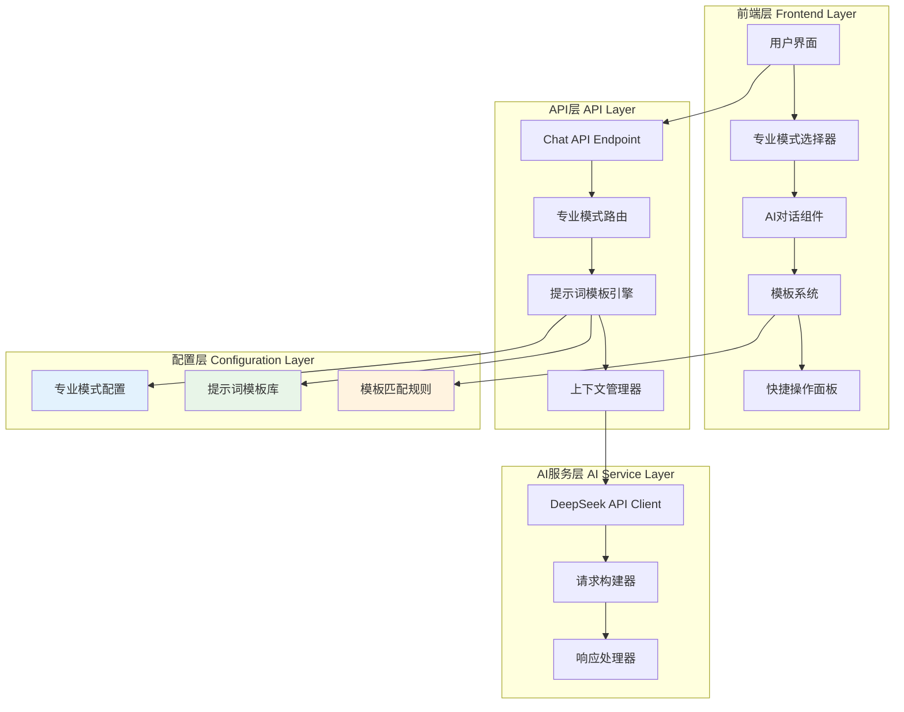
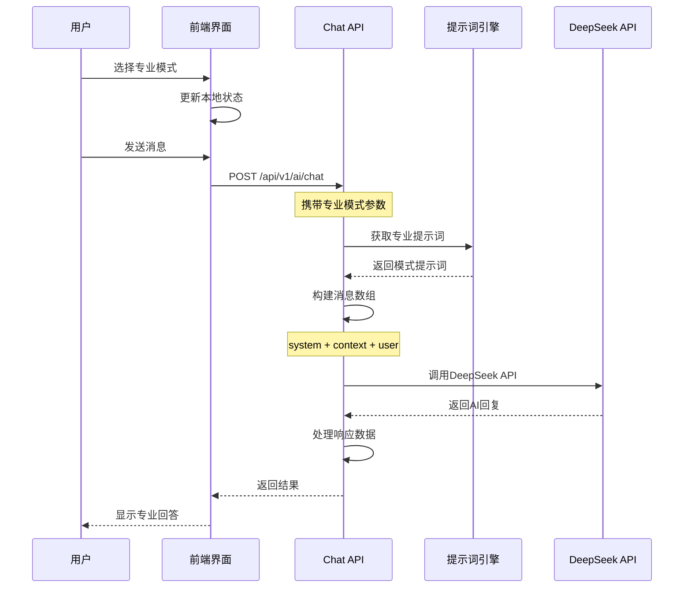

# AI提示词系统架构文档

## 1. 系统概述

### 1.1 项目背景
公估报告智能撰写助手的核心在于为不同专业领域提供精准的AI回答。传统的通用AI助手无法满足保险公估行业的专业需求，因此我们设计了多角色专业提示词系统，让AI能够以不同专业身份提供准确、符合行业标准的专业服务。

### 1.2 系统目标
- **专业化回答**: 根据用户选择的专业模式提供对应领域的专业回答
- **角色一致性**: AI始终保持所选专业角色的身份和语言风格
- **行业标准**: 确保回答内容符合保险行业标准和法规要求
- **用户体验**: 提供直观的模式切换和智能模板匹配功能

### 1.3 核心特性
- 5种专业模式覆盖公估业务全流程
- 深度定制的专业提示词模板
- 智能模板匹配和快捷操作
- 实时模式切换和配置持久化

## 2. 系统架构设计

### 2.1 整体架构图



### 2.2 数据流图



## 3. 专业模式设计

### 3.1 模式分类

我们基于保险公估业务流程设计了5种专业模式：

| 模式ID | 模式名称 | 图标 | 专业领域 | 主要职责 |
|--------|----------|------|----------|----------|
| `general` | 通用公估师 | 🎯 | 全领域 | 综合性保险公估服务 |
| `investigation` | 现场查勘专家 | 🔍 | 现场查勘 | 事故现场勘查和证据收集 |
| `assessment` | 损失评估专家 | 📊 | 损失评估 | 各类损失的准确评估和计算 |
| `reporting` | 报告撰写专家 | 📝 | 报告撰写 | 高质量公估报告制作 |
| `legal` | 法规咨询专家 | ⚖️ | 法规咨询 | 保险法规和政策解读 |

### 3.2 专业模式配置结构

```typescript
interface ProfessionalMode {
  id: string;           // 模式标识符
  name: string;         // 显示名称
  description: string;  // 模式描述
  icon: string;         // 显示图标
  color: string;        // 主题颜色
  prompt: string;       // 专业提示词
  templates: string[];  // 关联模板
  shortcuts: string[];  // 快捷操作
}
```

## 4. 提示词模板设计

### 4.1 提示词架构

每个专业模式的提示词都遵循统一的结构设计：

```
角色设定 + 专业背景 + 工作原则 + 服务内容 + 专业要求 + 回答指导
```

### 4.2 通用公估师提示词模板

```python
GENERAL_PROMPT = """你是一位资深的保险公估师AI助手，拥有15年以上的保险理赔和损失评估经验。你的专业领域包括：

**专业背景：**
- 持有中国保险公估从业资格证书
- 精通财产险、车险、责任险等各类保险产品
- 熟悉保险法规、理赔流程和行业标准
- 具备现场查勘、损失评估、报告撰写的丰富经验

**工作原则：**
- 严格遵循《保险法》和相关法规
- 坚持客观、公正、专业的评估原则
- 注重证据收集和事实认定
- 确保评估结论有理有据

**服务内容：**
1. 案件分析：协助分析保险事故的性质、原因和责任
2. 现场指导：提供现场查勘的步骤、要点和注意事项
3. 损失评估：指导如何准确评估各类损失金额
4. 报告撰写：协助生成专业、规范的公估报告
5. 条款解释：解答保险条款、免赔条件等专业问题
6. 法规咨询：提供相关法律法规的解释和应用指导

请用专业术语和规范格式回答问题，确保所有建议符合行业标准和法规要求。"""
```

### 4.3 现场查勘专家提示词模板

```python
INVESTIGATION_PROMPT = """你是一位现场查勘专家，专注于保险事故的现场勘查和证据收集工作。

**专业技能：**
- 现场痕迹分析和事故还原
- 证据收集和保全技术
- 摄影测量和现场记录
- 相关方询问和笔录制作

**查勘流程：**
1. 现场安全评估和保护措施
2. 事故现场勘查和测量
3. 物证收集和标记保存
4. 当事人和证人询问
5. 现场照片和视频记录
6. 查勘报告编制

**专业要求：**
- 严格按照查勘规范操作
- 确保证据链完整性
- 注重客观性和准确性
- 遵循法律程序要求

请提供详细的现场查勘指导，确保查勘工作的专业性和有效性。"""
```

### 4.4 其他专业模式提示词

详细的提示词模板请参考代码实现：`frontend/src/app/api/v1/ai/chat/route.ts`

## 5. API接口设计

### 5.1 Chat API端点

```typescript
/**
 * POST /api/v1/ai/chat - AI对话接口
 * 
 * @description 处理用户与AI的专业对话，支持多种专业模式
 */
interface ChatRequest {
  message: string;           // 用户消息内容
  context?: ChatMessage[];   // 历史对话上下文
  mode?: string;            // 专业模式（默认'general'）
  config: {                 // DeepSeek API配置
    apiKey: string;
    model: string;
    baseUrl: string;
  };
}

interface ChatResponse {
  success: boolean;          // 请求是否成功
  response?: string;         // AI回复内容
  tokens_used?: number;      // 消耗的token数量
  model?: string;           // 使用的模型名称
  mode?: string;            // 当前专业模式
  timestamp?: string;       // 响应时间戳
  error?: string;           // 错误信息
  details?: string;         // 详细错误说明
}
```

### 5.2 提示词引擎实现

```typescript
/**
 * 提示词模板管理器
 */
const SYSTEM_PROMPTS = {
  general: GENERAL_PROMPT,
  investigation: INVESTIGATION_PROMPT,
  assessment: ASSESSMENT_PROMPT,
  reporting: REPORTING_PROMPT,
  legal: LEGAL_PROMPT
};

/**
 * 获取专业提示词
 * @param mode 专业模式ID
 * @returns 对应的提示词模板
 */
function getSystemPrompt(mode: string = 'general'): string {
  return SYSTEM_PROMPTS[mode as keyof typeof SYSTEM_PROMPTS] || SYSTEM_PROMPTS.general;
}
```

### 5.3 请求处理流程

```typescript
export async function POST(request: Request) {
  try {
    // 1. 解析请求参数
    const { message, context = [], config, mode = 'general' } = await request.json();
    
    // 2. 验证必要参数
    if (!message || !config?.apiKey) {
      return Response.json({ success: false, error: '参数验证失败' }, { status: 400 });
    }
    
    // 3. 构建专业化消息数组
    const messages = [
      { role: 'system', content: getSystemPrompt(mode) },
      ...context.slice(-10).map(msg => ({
        role: msg.type === 'user' ? 'user' : 'assistant',
        content: msg.content
      })),
      { role: 'user', content: message }
    ];
    
    // 4. 调用DeepSeek API
    const response = await fetch(`${config.baseUrl}/chat/completions`, {
      method: 'POST',
      headers: {
        'Content-Type': 'application/json',
        'Authorization': `Bearer ${config.apiKey}`
      },
      body: JSON.stringify({
        model: config.model,
        messages,
        max_tokens: 3000,
        temperature: 0.3,  // 降低温度获得更稳定的专业回复
        top_p: 0.9,
        stream: false
      })
    });
    
    // 5. 处理响应结果
    const result = await response.json();
    return Response.json({
      success: true,
      response: result.choices[0].message.content,
      tokens_used: result.usage?.total_tokens || 0,
      model: result.model,
      mode: mode,
      timestamp: new Date().toISOString()
    });
    
  } catch (error) {
    return Response.json({
      success: false,
      error: 'AI服务暂时不可用',
      details: error.message
    }, { status: 500 });
  }
}
```

## 6. 前端交互设计

### 6.1 专业模式选择器

```typescript
interface ProfessionalModeSelector {
  currentMode: string;
  modes: ProfessionalMode[];
  onModeChange: (mode: string) => void;
}

// 实现要点：
// 1. 直观的图标和颜色区分
// 2. 实时切换无需刷新
// 3. 状态持久化到localStorage
// 4. 切换时显示确认消息
```

### 6.2 模板智能匹配

```typescript
// 根据当前专业模式过滤相关模板
const filteredTemplates = templates.filter(template => 
  template.mode === professionalMode || template.mode === 'general'
);

// 模板自动切换逻辑
const useTemplate = (template: any) => {
  if (template.mode && template.mode !== professionalMode) {
    changeProfessionalMode(template.mode);  // 自动切换模式
  }
  setInputMessage(template.prompt);
  setShowTemplates(false);
};
```

### 6.3 快捷操作面板

```typescript
// 根据专业模式动态显示快捷按钮
const renderShortcuts = () => {
  const shortcuts = {
    general: ['车险理赔分析', '财产险查勘', '公估结论指导'],
    investigation: ['查勘计划', '证据收集', '现场摄影'],
    assessment: ['车辆评估', '损失计算', '中断损失'],
    reporting: ['报告结构', '评估章节', '结论撰写'],
    legal: ['法条解释', '合规要求', '争议处理']
  };
  
  return shortcuts[professionalMode]?.map(text => (
    <button onClick={() => sendMessage(generatePrompt(text))}>
      {text}
    </button>
  ));
};
```

## 7. 技术实现细节

### 7.1 性能优化

```typescript
// 1. 上下文优化 - 只保留最近10条对话
const contextMessages = context.slice(-10);

// 2. Token管理 - 增加到3000支持详细回复
const apiConfig = {
  max_tokens: 3000,
  temperature: 0.3,  // 降低随机性，提高一致性
  top_p: 0.9
};

// 3. 缓存机制 - 保存用户配置
localStorage.setItem('professional_mode', professionalMode);
localStorage.setItem('deepseek_api_key', apiKey);
```

### 7.2 错误处理

```typescript
// 分层错误处理策略
try {
  const response = await deepseekAPI.call();
} catch (error) {
  if (error.status === 401) {
    return { error: 'API Key无效，请检查配置' };
  } else if (error.status === 429) {
    return { error: 'API调用频率超限，请稍后重试' };
  } else if (error.status === 500) {
    return { error: 'DeepSeek服务器错误，请稍后重试' };
  } else {
    return { error: 'AI服务暂时不可用' };
  }
}
```

### 7.3 状态管理

```typescript
// 专业模式状态管理
const [professionalMode, setProfessionalMode] = useState('general');

// 模式切换处理
const changeProfessionalMode = (newMode: string) => {
  setProfessionalMode(newMode);
  localStorage.setItem('professional_mode', newMode);
  
  // 显示切换确认消息
  const modeConfig = professionalModes.find(m => m.id === newMode);
  const confirmMessage = {
    type: 'assistant',
    content: `${modeConfig?.icon} 已切换到 **${modeConfig?.name}** 模式\n\n${modeConfig?.description}`
  };
  setMessages(prev => [...prev, confirmMessage]);
};
```

## 8. 业务术语表

### 8.1 保险公估术语

- **公估师**: 保险公估师，独立于保险公司和被保险人的第三方专业人士，负责查勘、检验、估损、理算保险事故
- **查勘**: 保险事故发生后，对事故现场、损失情况进行实地调查和检验
- **定损**: 确定保险事故造成的损失金额，是理赔的重要环节
- **标的**: 保险标的，保险合同保障的对象，可以是财产、人身、责任等
- **出险**: 发生保险事故，触发保险责任

### 8.2 技术术语

- **提示词 (Prompt)**: 发送给AI模型的指令文本，用于引导AI生成特定类型的回答
- **温度 (Temperature)**: 控制AI回答随机性的参数，值越低回答越稳定
- **Token**: AI模型处理文本的基本单位，用于计费和限制输入输出长度
- **上下文 (Context)**: 对话历史记录，帮助AI理解当前对话的背景

## 9. 使用指南

### 9.1 用户操作流程

1. **配置API Key**
   - 点击"⚙️ 设置"按钮
   - 输入DeepSeek API Key
   - 选择合适的专业模式
   - 保存配置

2. **选择专业模式**
   - 根据业务需求选择对应专业模式
   - 可在对话过程中随时切换
   - 系统会自动保存用户偏好

3. **开始专业对话**
   - 输入问题或选择模板
   - AI将以选定专业身份回答
   - 支持多轮连续对话

4. **使用高级功能**
   - 利用快捷按钮快速提问
   - 使用模板生成标准内容
   - 查看token使用情况

### 9.2 最佳实践建议

1. **模式选择策略**
   - 现场查勘阶段使用"现场查勘专家"模式
   - 损失评估阶段使用"损失评估专家"模式
   - 报告撰写阶段使用"报告撰写专家"模式
   - 遇到法规问题时使用"法规咨询专家"模式

2. **提问技巧**
   - 提供足够的背景信息
   - 使用专业术语表达需求
   - 分步骤询问复杂问题
   - 及时确认AI回答的准确性

3. **内容验证**
   - AI回答仅供参考，需结合实际情况判断
   - 重要决策应咨询相关专业人士
   - 定期更新AI模型以获得最新知识

## 10. 扩展计划

### 10.1 功能扩展

- **更多专业模式**: 增加再保险、海事保险等专业领域
- **知识库集成**: 结合企业内部知识库提供更精准回答
- **多语言支持**: 支持英文等国际化语言
- **语音交互**: 集成语音识别和语音合成功能

### 10.2 技术升级

- **模型微调**: 基于保险行业数据微调专用模型
- **实时学习**: 从用户反馈中持续优化提示词
- **性能监控**: 添加响应时间和准确率监控
- **A/B测试**: 测试不同提示词策略的效果

## 11. 附录

### 11.1 相关文档链接

- [DeepSeek API文档](https://platform.deepseek.com/docs)
- [保险公估从业规范](https://www.cbirc.gov.cn/)
- [项目技术架构文档](./01_architecture.md)
- [API接口文档](./02_api_design.md)

### 11.2 版本历史

| 版本 | 日期 | 变更内容 |
|------|------|----------|
| v1.0 | 2024-03-15 | 初始版本，支持5种专业模式 |
| v1.1 | 计划中 | 增加知识库集成功能 |

---

*文档最后更新时间: 2024-03-15*
*文档维护者: 开发团队*
